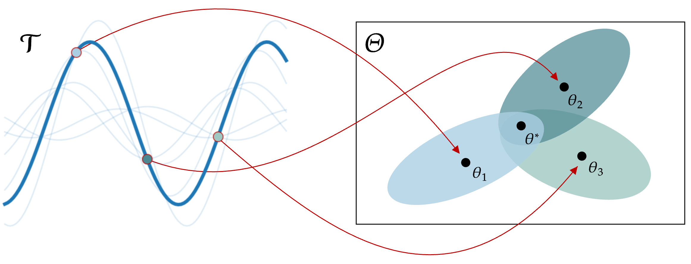

# Reducing Variance in Meta-Learning via Laplace Approximation for Regression Tasks (LAVA)
This repository contains the implementation for "Reducing Variance in Meta-Learning via Laplace Approximation for Regression Tasks". 

<center>

</center>


## Setup

The codebase is implemented in Python 3.9. You can install the required dependencies using the following command:

```
pip install -r requirements.txt
```

## Experiments
To train a model, variations of the following command is used:

```python main.py --model-name {PREFIX} --dataset {DATASET} --model {MODEL_NAME} --steps {STEPS} --adaptation {ADAPTATION} --context-dim {CONTEXT_DIM} --support-size {SUPPORT_SIZE}```

An explanation of the parameters follows below:
```
model-name: prefix of the directory to save the model. By default, models are saved in the `checkpoints/{model_name}` directory.

dataset: [mass-spring, fitz, vanderpol, pendulum, sine]

model: ['lava', 'maml', 'vr-maml', 'metamix', 'vfml', 'llama']

steps: Number of steps to perform in the inner-loop update

adaptation: One of ['full', 'conditional', 'head'] which considers updating all parameters (MAML), using conditioning (CAVIA) or only updated the last layer (ANIL). Currently LAVA does not suppport the adaptation over the full parameters.

context-dim: Dimensions to using conditioning (adaptation == 'conditional'), ignored otherwise

support-size: Number of samples in the support-data
```

An example on how to train LAVA on the sine data is:

```
python main.py --model-name readme --dataset sine --model lava --steps 1 --adaptation head --support-size 10
```

## Evaluation
After running experiments, evaluation results are saved in the `checkpoints/{model_name}` directory. Each model's directory contains two files:
results_test.pkl: Contains the results of testing the model.
results_train.pkl: Contains the results from the training phase.
The model results are also saved in the tensorboard directory